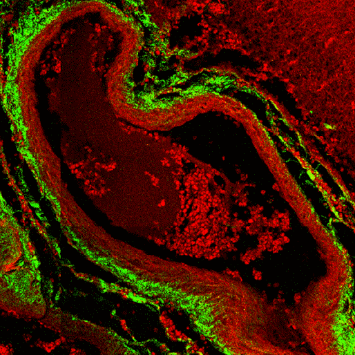
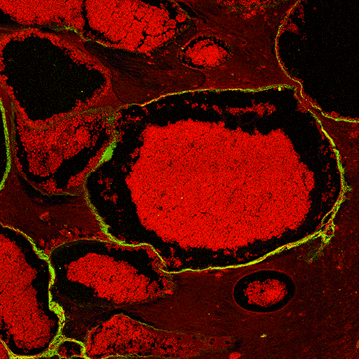
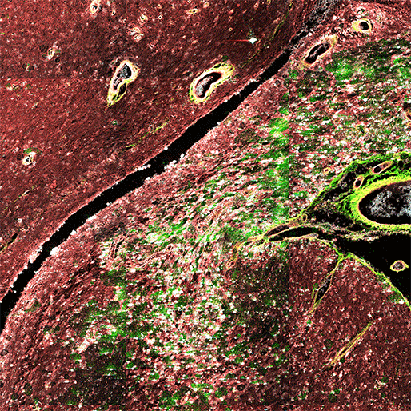

# CCM-stainGAN

This code is for the virtual staining part of paper ***Resection-Inspired Histopathological Diagnosis of Cerebral Cavernous Malformations Us******ing Quantitative Multiphoton Microscopy***.

## Preview

|                      2 Channels                      |                       2 Channels                       |                       3 Channels                       |
| :---------------------------------------------------: | :----------------------------------------------------: | :----------------------------------------------------: |
|  |  |  |

## Network architecture


## 1. Create Envirement:

- Python 3.6 (Recommend to use [Anaconda](https://www.anaconda.com/download/#linux))
- NVIDIA GPU + [CUDA](https://developer.nvidia.com/cuda-downloads)
- [PyTorch](https://pytorch.org/get-started/previous-versions/) >= 1.8.0
- Python packages:

  ```shell
  cd CCM-stainGAN
  
  conda activate CCM-stainGAN
  
  pip install -r requirements.txt
  ```

## 2. Data Preparation

- The MPM and H&E images are available, download from ([Google Drive](https://www.google.com) / [Baidu Disk](https://www.baidu.com)). 

  **Note:** access code for `Baidu Disk` is `ccm1`.
  
- Split the images into tiles

- Place the training MPM tiles to `/CCM-stainGAN/dataset/trian/A/` and the H&E tiles to `/CCM-stainGAN/dataset/trian/B/`

- Place the training MPM category tiles to `/CCM-stainGAN/dataset/trian/cls_A`  and the H&E  category tiles to `/CCM-stainGAN/dataset/trian/cls_B`  

- Place the testing MPM tiles to `/CCM-stainGAN/dataset/test/A/` and the H&E tiles to `/CCM-stainGAN/dataset/test/B/`

- Then this repo is collected as the following form:

  ```shell
  |--CCM-stainGAN
    |--train.py
    |--utils.py
    |--data_utils.py
    |--test.py
    |--output
    |--dataset
      |--MPM2HE
        |--train
          |--A
            |--mpm_000.png
            |--mpm_001.png
            :
            |--mpm_099.png
          |--B
            |--he_000.png
            |--he_001.png
            :
            |--he_099.png
          |--cls_A
            |--he_001_0.png
            |--he_002_0.png
            :
            |--he_099_8.png
          |--cls_B
            |--mpm_001_0.png
            |--mpm_002_0.png
            :
            |--mpm_099_8.png
        |--test
          |--A
            |--mpm_000.png
            :
            |--mpm_099.png
          |--B
            |--he_000.png
            :
            |--he_099.png
  ```
  
  **Note:**
  
  The image's name of category  dataset must add category label in the end of name , which split of '_'. Such as: img_001_0.png, img_002_0.png, img_003_1.png, img_004_1.png.  The last number is the label of the dataset.
## 3. Training

```shell
(1) Download the data and split the images in the correct place.

(2) Run the following command to train the model

cd /CCM-stainGAN/

# transform by CCM-stainGAN
python train_cls.py --end_epoch 100 --batch_size 4 --batch_size_cls 16 --num_classes 9 --decay_epoch 50 --gpu_ids 0,1,2,3 --threshhold_A 35 --threshhold_B 180 --env ccm

# transform by CycleGAN
python train_cycle.py --end_epoch 100 --batch_size 4 --decay_epoch 50 --gpu_ids 0,1,2,3 --env cycle

# transform by UTOM
python train_utom.py --end_epoch 100 --batch_size 4 --decay_epoch 50 --gpu_ids 0,1,2,3 --threshhold_A 35 --threshhold_B 180 --env utom
```

Or run the following command:

```shell
cd /CCM-stainGAN/

# transform by CCM-stainGAN
bash train_cls.sh

# transform by CycleGAN
bash train_cycle.sh

# transform by UTOM
bash train_utom.sh
```

The models will be saved in `/CCM-stainGAN/output/{env}/`.

## Citation

If the repo helps you, please consider citing our works;

```shell
# CCM-stainGAN

```
